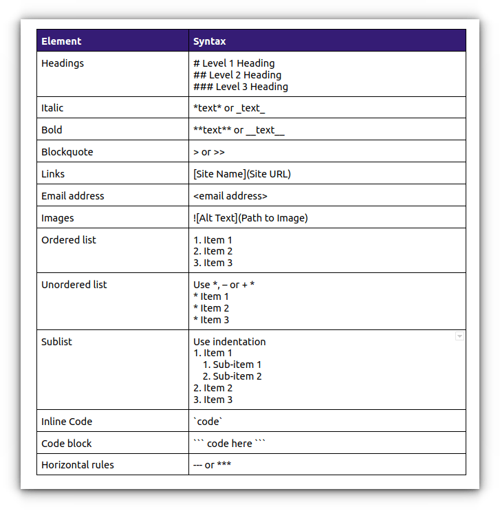

# Transcriptomics Notebook

**course:** Intro to Ecological Genomics - Fall 2026

### Julian Drezner

------------------------------------------------------------------------

## 9/15/26 - Learning how to make a notebook/markdown

-   learn markdown

-   push notes to github

**Working Directory**

`/gpfs1/home/j/d/jdrezner/Projects/eco_genomics_2026`

**Input Files:**

**Output Files:**

**Programs and Dependencies:**

**Scripts:**

`none`

**Code:**

``` r
Library()

print("This is code")
```

**Table:**

| Col1     | Col2 | Col3 |
|----------|------|------|
| /"table" |      |      |
|          |      |      |
|          |      |      |



To add this image, "/image -\> browse"

**Notes & Obs**:

-   Made a table

-   input an image (added a cheat sheet)

------------------------------------------------------------------------

------------------------------------------------------------------------

## 9/17/26- Intro to the cocopod study system and review of transcriptomics

**Notes:**

-   I am not sure how to access the notes on gihub

-   

**Code**:

`Welcome to the Vermont Advanced Computing Center   University of Vermont  ·  Research Computing   Docs            https://www.uvm.edu/vacc/docs/   Open OnDemand   https://ondemand.vacc.uvm.edu/   Virtual Café    https://www.uvm.edu/it/research-computing-events   Help            vacchelp@uvm.edu [jdrezner@vacc-login4 jdrezner]$ cd /gpfs1/cl/biol3990 [jdrezner@vacc-login4 biol3990]$ pwd /gpfs1/cl/biol3990 [jdrezner@vacc-login4 biol3990]$ ll total 1 drwxrwsr-x 5 mpespeni biol3990 4096 Sep 15 11:42 Transcriptomics [jdrezner@vacc-login4 biol3990]$ ls Transcriptomics [jdrezner@vacc-login4 biol3990]$ cd Transcriptomics/ [jdrezner@vacc-login4 Transcriptomics]$ ll total 3 drwxrwsr-x 2 mpespeni biol3990 4096 Sep 15 11:42 CleanData drwxrwsr-x 2 mpespeni biol3990 4096 Sep 15 11:41 CountsMatrix drwxrwsr-x 2 mpespeni biol3990 4096 Sep 15 11:29 RawData [jdrezner@vacc-login4 Transcriptomics]$ cd C -bash: cd: C: No such file or directory [jdrezner@vacc-login4 Transcriptomics]$ cd C CleanData/    CountsMatrix/  [jdrezner@vacc-login4 Transcriptomics]$ cd CleanData/ [jdrezner@vacc-login4 CleanData]$ ll total 9574520 -rw-r--r-- 1 mpespeni biol3990 1443367162 Sep 15 11:38 AA_F0_Rep1_1_clean.fq.gz -rw-r--r-- 1 mpespeni biol3990 1466551500 Sep 15 11:38 AA_F0_Rep1_2_clean.fq.gz -rw-r--r-- 1 mpespeni biol3990 1747188307 Sep 15 11:38 AA_F0_Rep2_1_clean.fq.gz -rw-r--r-- 1 mpespeni biol3990 1780157475 Sep 15 11:38 AA_F0_Rep2_2_clean.fq.gz -rw-r--r-- 1 mpespeni biol3990 1659953125 Sep 15 11:38 AA_F0_Rep3_1_clean.fq.gz -rw-r--r-- 1 mpespeni biol3990 1707066880 Sep 15 11:38 AA_F0_Rep3_2_clean.fq.gz [jdrezner@vacc-login4 CleanData]$ zcat gzip: compressed data not read from a terminal. Use -f to force decompression. For help, type: gzip -h [jdrezner@vacc-login4 CleanData]$ zcat AA_F0_Rep3_2_clean.fq.gz | head -n 8 @A00742:278:HH5VYDSX2:2:1101:3965:1000 2:N:0:CTCGTGTA+NTAGGCTT TGGCAGATAGAGAAGAAGGGAAGGAGTACACCATTGAACACCTGTGCTATCAGAATAACAGTTGTTCTTTCATCTACACCAATTAAGGAGTTAACAAAAGCTGCAACAATGACCATAACAACCATTATTGCCATGTAAATCCACCGCGGC + FFFFFFF:FFFFFFFFFFFFF,FFFFFFFFFFFFFFFFFFFFFFFFFFFFFFFFFFFFFFFFFFFFFFFFFFFFFFFFFFFFFFFFFFFFFFFFFFFFFFFFFFFF:FFF,FFFFFF:FFFFF:FFFFFFFFFFFFFFFFFF:FFFFFFF @A00742:278:HH5VYDSX2:2:1101:11614:1000 2:N:0:CTCGTGTA+NTAGGCTT ATTTTAGAAACCAATAAAAGTTTTTCTTCTTCACTAAAAGAGGTTGCTGTCCAAGGATTAGGTTCACTACCAACTTTCATAGCTTTCAGCTTATCAGATTCAAAAAAAGCATCCGGAGGAAAGTGATCACTACAGAGTCTGGAGTTGATG + FF:FFFFFFFFFFFFFFFFFFFFFFFFFFFFFFFFFFFFF:FFFFFFFFFFFFFFFFFFFFFFFFFFFFFFFFF:FFFFFFFFFFFFFFF:FFFFFFFFF,FFFFFFFFFFF:,FFFF,F:FFFFFFFFFFFFFFFFFFFF,FFFFFFFF [jdrezner@vacc-login4 CleanData]$ zcat AA_F0_Rep3_2_clean.fq.gz | head -n 4 @A00742:278:HH5VYDSX2:2:1101:3965:1000 2:N:0:CTCGTGTA+NTAGGCTT TGGCAGATAGAGAAGAAGGGAAGGAGTACACCATTGAACACCTGTGCTATCAGAATAACAGTTGTTCTTTCATCTACACCAATTAAGGAGTTAACAAAAGCTGCAACAATGACCATAACAACCATTATTGCCATGTAAATCCACCGCGGC + FFFFFFF:FFFFFFFFFFFFF,FFFFFFFFFFFFFFFFFFFFFFFFFFFFFFFFFFFFFFFFFFFFFFFFFFFFFFFFFFFFFFFFFFFFFFFFFFFFFFFFFFFF:FFF,FFFFFF:FFFFF:FFFFFFFFFFFFFFFFFF:FFFFFFF [jdrezner@vacc-login4 CleanData]$  [jdrezner@vacc-login4 CleanData]$  [jdrezner@vacc-login4 CleanData]$  [jdrezner@vacc-login4 CleanData]$  [jdrezner@vacc-login4 CleanData]$  [jdrezner@vacc-login4 CleanData]$  [jdrezner@vacc-login4 CleanData]$  [jdrezner@vacc-login4 CleanData]$  [jdrezner@vacc-login4 CleanData]$  [jdrezner@vacc-login4 CleanData]$  [jdrezner@vacc-login4 CleanData]$  [jdrezner@vacc-login4 CleanData]$  [jdrezner@vacc-login4 CleanData]$  [jdrezner@vacc-login4 CleanData]$  [jdrezner@vacc-login4 CleanData]$  [jdrezner@vacc-login4 CleanData]$  [jdrezner@vacc-login4 CleanData]$  [jdrezner@vacc-login4 CleanData]$  [jdrezner@vacc-login4 CleanData]$  [jdrezner@vacc-login4 CleanData]$  [jdrezner@vacc-login4 CleanData]$  [jdrezner@vacc-login4 CleanData]$  [jdrezner@vacc-login4 CleanData]$  [jdrezner@vacc-login4 CleanData]$  [jdrezner@vacc-login4 CleanData]$  [jdrezner@vacc-login4 CleanData]$  [jdrezner@vacc-login4 CleanData]$  [jdrezner@vacc-login4 CleanData]$  [jdrezner@vacc-login4 CleanData]$  [jdrezner@vacc-login4 CleanData]$ zcat AA_F0_Rep3_2_clean.fq.gz | wc -l 93638040 [jdrezner@vacc-login4 CleanData]$`

------------------------------------------------------------------------
